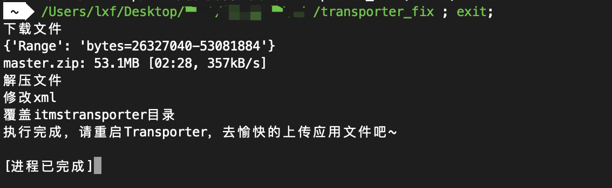
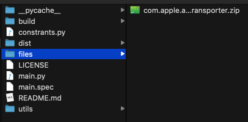

# transporter_fix
修复transporter一直卡在正在验证不动的问题


## 使用


安装依赖

```shell
pip install requests
pip install tqdm
```


运行

```shell
git clone git@github.com:LinXunFeng/transporter_fix.git

cd transporter_fix

python main.py
```


## 懒人版

直接下载 [transporter_fix](https://github.com/LinXunFeng/transporter_fix/releases) 后双击运行即可。




## 其它

如果当前正常网络对 `github` 不给力，有两个选择选择

1. 全局科学环境
2. 下载蓝奏云上的压缩包，存放到同目录级别的 `files` 目录下即可（推荐）


[点我下载压缩包](https://www.lanzous.com/b0aqkmhpg)，找个离当前日期最近的下载，记得下载下来后改名为 `com.apple.amp.itmstransporter.zip`


`com.apple.amp.itmstransporter.zip` 存储位置


懒人版


开发版




