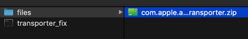

# transporter_fix


## 功能
> 修复transporter一直卡在正在验证不动的问题，也适用于fastlane脚本上传ipa的方式

***好用请star，鼓励一下我哦！！！***

## 更新记录

> 请直接使用最新版本

| transporter_fix 版本                                         | 苹果核心上传工具版本 | 日期     |
| ------------------------------------------------------------ | -------------------- | -------- |
| [0.0.2](https://github.com/LinXunFeng/transporter_fix/releases/tag/0.0.2) | 2.1.0                | 20201230 |
| [0.0.1](https://github.com/LinXunFeng/transporter_fix/releases/tag/0.0.1) | 2.0.0                | 20200311 |


## 使用

### 开发版

安装依赖

```shell
# 纯净方式
pip install requests
pip install tqdm

# 懒人方式
pip install -r requirements.txt
```

运行

```shell
git clone git@github.com:LinXunFeng/transporter_fix.git

cd transporter_fix

python main.py
```


### 懒人版

直接下载 [transporter_fix](https://github.com/LinXunFeng/transporter_fix/releases) 后双击运行即可。


## 其它

如果当前正常网络对 `github` 不给力，有两个选择选择

1. 全局科学环境
2. 下载蓝奏云上的压缩包，存放到同目录级别的 `files` 目录下即可（推荐）


[点我下载压缩包](https://linxunfeng.lanzous.com/b0aqkmhpg)，找个离当前日期最近的下载，记得下载下来后改名为 `com.apple.amp.itmstransporter.zip`


`com.apple.amp.itmstransporter.zip` 存储位置


懒人版



开发版


## Author

- LinXunFeng
- email: [linxunfeng@yeah.net](mailto:linxunfeng@yeah.net)
- Blogs: [全栈行动](https://fullstackaction.com/) | [LinXunFeng‘s Blog](http://linxunfeng.top/)  | [掘金](https://juejin.im/user/58f8065e61ff4b006646c72d/posts) 


